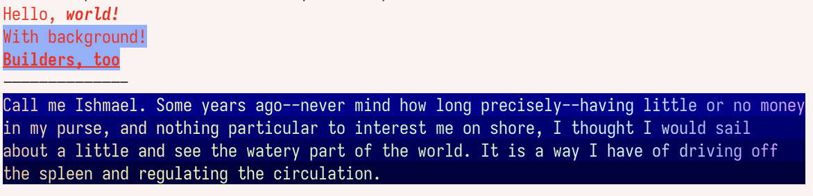

[](https://github.com/juri/terminal-styles/actions/workflows/ci.yml)
[](https://github.com/juri/terminal-styles/actions/workflows/format.yml)
[](https://swiftpackageindex.com/juri/terminal-styles)
[](https://swiftpackageindex.com/juri/terminal-styles)

# terminal-styles

``terminal-styles`` is a small Swift library for building up terminal output styles. It builds on [terminal-ansi].

[terminal-ansi]: https://github.com/juri/terminal-ansi.git

## Example

```swift
@main
struct Runner {
    static func main() {
        self.styles()
        print("--------------")
        self.gradient()
    }

    static func styles() {
        var style = Style(foreground: [.colorRGB(.init(intR: 0xff, g: 0, b: 0))])
        print(style.apply(to: "Hello, "), terminator: "")
        print(style.adding(foregrounds: [.bold, .italic]).apply(to: "world!"))
        style.add(background: .colorRGB(.init(intR: 0x90, g: 0xB0, b: 0xFF)))
        print(style.apply(to: "With background!"))

        let styleAndUnderline = StyleBuilder.styledOutput {
            style
            Foreground.underline
        }

        StyleBuilder.print {
            Foreground.colorRGB(.init(intR: 0x40, g: 0xD0, b: 0x90))
            Foreground.bold
            styleAndUnderline
            "Builders, too"
        }
    }

    static func gradient() {
        var lines = """
            Call me Ishmael. Some years ago--never mind how long precisely--having little or no money
            in my purse, and nothing particular to interest me on shore, I thought I would sail 
            about a little and see the watery part of the world. It is a way I have of driving off
            the spleen and regulating the circulation.
            """.split(separator: "\n")
        let maxLine = lines.map(\.count).max()!
        lines = lines.map { $0 + String(repeating: " ", count: maxLine - $0.count) }
        let fgGradientHSL = LinearGradientHSL(
            length: maxLine,
            stops: [
                (0.0, HSLColor(hue: 30, saturation: 0.9, luminance: 0.8)),
                (0.7, HSLColor(hue: 140, saturation: 0.8, luminance: 0.9)),
                (1.0, HSLColor(hue: 290, saturation: 0.9, luminance: 0.8)),
            ]
        )!
        let fgGradient = HorizontalForegroundPerCharacterStyler(hslGradient: fgGradientHSL)
        let bgGradient = VerticalBackgroundPerCharacterStyler(
            linearGradientLength: lines.count,
            stops: [
                (0.0, RGBColor8(intR: 0x00, g: 0x00, b: 0x90)),
                (1.0, RGBColor8(intR: 0x00, g: 0x00, b: 0x40)),
            ]
        )!

        let joinedGradient = JoinedPerCharacterStyler(styler1: fgGradient, styler2: bgGradient)

        print(joinedGradient.apply(lines: lines, addNewLines: true, reset: true))
    }
}
```



## Documentation

[Documentation] and `Package.swift` snippets are available at [Swift Package Index].

[Documentation]: https://swiftpackageindex.com/juri/terminal-styles/documentation/terminalstyles
[Swift Package Index]: https://swiftpackageindex.com/juri/terminal-styles
